## Apresentação da disciplina

* Por que compiladores ?
* Visão Geral dos Compiladores
* Ementa e referências
* Metodologia
* Avaliação

***
### Por que compiladores ?


Subáreas de conhecimento do CNPQ:

* Sistemas de Computação
  * Hardware 
  * Arquitetura de Sistemas de Computação 
  * Software Básico 
  * Teleinformática
> Compiladores é um  exemplo de software básico. Essa é uma linha que o engenheiro da computação pode atuar.

***

### Por que compiladores ?

Segundo Cooper Keith, 

> "Compiladores são programas grandes e complexos, e geralmente incluem centenas de milhares, ou mesmo milhões, de linhas de código, organizadas em múltiplos subsistemas e componentes. As várias partes de um compilador interagem de maneira complexa. Decisões de projeto tomadas para uma parte do compilador têm ramificações importantes para as outras. Assim, o projeto e a implementação de um compilador é um exercício substancial em engenharia de software".

O autor ainda destaca que  um bom compilador contém um microcosmo da ciência da computação, incluindo

* algoritmos gulosos (alocação de registradores), técnicas de busca heurística (agendamento de lista), algoritmos de grafos (eliminação de código morto), 
  
* programação dinâmica (seleção de instruções), autômatos finitos e autômatos de pilha (análises léxica e sintática) e algoritmos de ponto fixo (análise de fluxo de dados). 
  
* Lida com problemas, como alocação dinâmica, sincronização, nomeação, localidade, gerenciamento da hierarquia de memória e escalonamento de pipeline. 


***

### Por que compiladores ?

Essa mesma característica é destacada pelos autores do projeto Nand2Tetris


* Virtual machine
Stack architecture
OO implementation
Unit testing
Memory Management
Linked list
Graphical output
Pointers
Symbol table
Grammars
Two-tier compilation
Code generation
Sprites


***

### Sequência aconselhada

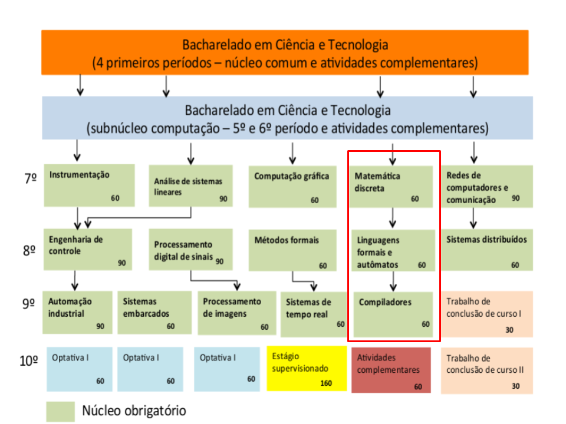


***

### Visão geral sobre compiladores

* Um **tradutor** é um programa que toma como entrada um programa escrito em uma linguagem de programação (a **linguagem fonte**) e produz como saída um programa (equivalente) em outra linguagem (a **linguagem objeto**).
*  Se a linguagem fonte é uma linguagem de alto-nível (C++, Haskell, Ada, Swift) e a linguagem objeto é uma linguagem de baixo-nível (“assembly” ou linguagem de máquina) então o tradutor é conhecido como **compilador**.


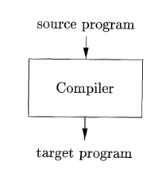

> Neste curso iremos implementar um tradutor e um compilador.

***

### Visão geral sobre compiladores: interpretador

Sendo o programa executável, ele pode ser então chamado para produzir saídas dado uma entrada:

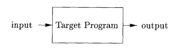


Um **interpretador** não produz um programa alvo, mas sim, executa o código diretamente em conjunto com as entradas:

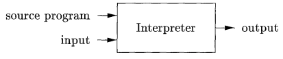

***

### Visão geral sobre compiladores: processo híbrido

A linguagem Java, Erlang, C# usam uma **processo hibrido**, em que o programa fonte é traduzido para uma linguagem intermediária.


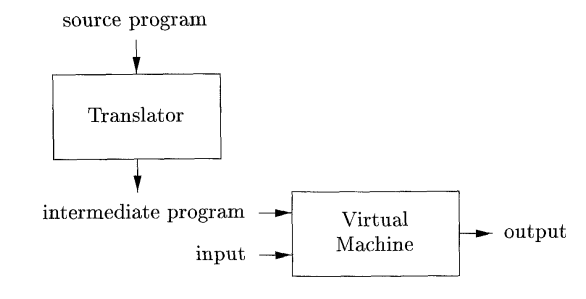

Linguagens intermediárias são usadas até mesmo em interpretadores. Por exemplo, em python:

```python
    import dis
    
    def dobro (x):
            return 2*x
    
    dis.dis(dobro)
```

Irá imprimir o código intermediária da função dobro:


    4           0 LOAD_CONST               1 (2)
                3 LOAD_FAST                0 (x)
                6 BINARY_MULTIPLY
                7 RETURN_VALUE


***

### Visão geral sobre compiladores em detalhes


Outros programas podem ainda ser utilizados no processo, como o pré-processador, o montador, linker e loader.


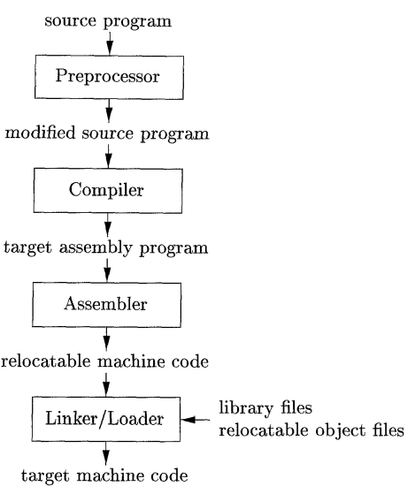


Nesse ponto, o compilador está sendo tratado com uma caixa preta, mas o processo de compilação pode ser decomposto nas seguintes etapas:


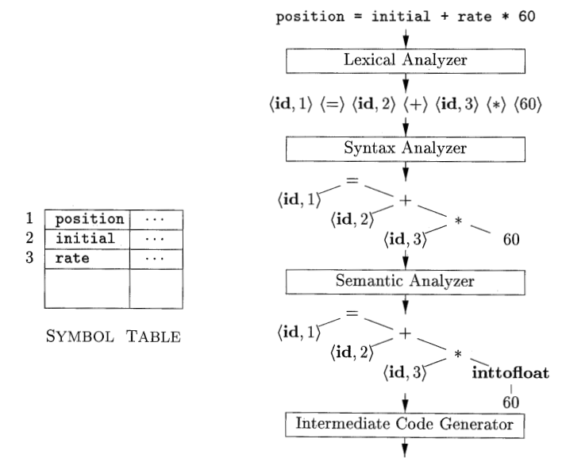


A partir do código intermediário:


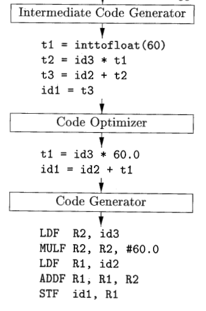


***
### Ementa 

* Compiladores e interpretadores. 
* Tipos de Compiladores. 
* Análise Léxica. 
* Tabela de Símbolos. 
* Análise Sintática. 
* Tratamento de erros sintáticos. 
* Análise semântica. Geração de código. 
* Noções de otimização de código. 
* Ambiente em tempo de execução. Gerência de memória

***
### Tópicos

1. A estrutura de um compilador
2. Linguagens de programação 
3. Especificação e projeto de uma linguagem
4. Construção de um analisador léxico 
5. Construção de um analisador sintático
6. Geração de código intermediário 
7. Geração de código de máquina
8. Gerência de memória
9. Noções de otimização
10. Analisador semântico

***

### Metodologia

* [Nand2Tetris](https://www.nand2tetris.org/)

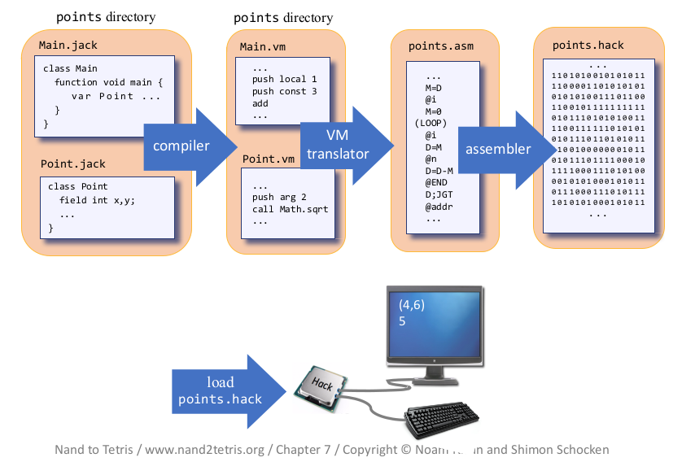

* A metodologia usada será uma adaptação do excelente curso  [Build a Modern Computer from First Principles: Nand to Tetris Part II (project-centered course)](https://www.coursera.org/learn/nand2tetris2).

* Duas diferenças principais:
  * Buscaremos aqui focar em alguns conceitos que não são tanto explorados pelo curso.
  * Usaremos aqui uma abordagem "top-down", ao invés da abordagem "bottom-up" usada no curso. Ou seja, partiremos da linguagem de alto nível até a linguagem assembly.


* Etapas
  * Estudar os conceitos
  * Usar as ferramentas de suporte
  * Construir o projeto (+- 10 horas por projeto)
  * Testar os módulos isoladamente
  * Divertir :)

***

### Metodologia e conceitos

Essa metodologia irá utilizar conceitos de diversas disciplinas, como:
* Estrutura de dados (arquitetura de pilha, lista encadeadas, …. )
* Arquitetura de computadores e Circuitos digitais 
* Linguagens formais (conceito de linguagem)
* Sistemas operacionais (gerenciamento de memória, entrada e saída de dados)
* Paradigmas de programação (linguagem de baixo nivel, procedural, orientação a objeto)

***

### Avaliação


As 5 semanas do coursera serão trabalhadas em 4 meses.  Dando mais tempo  para a conclusão dos projetos e assimilação dos conceitos. Serão desenvolvidos 6 projetos, em 4 passos ( 4 a 6 encontros):


| Passo                 | Professor                                                             | Aluno                                                                                                    |
|-----------------------|-----------------------------------------------------------------------|----------------------------------------------------------------------------------------------------------|
| Conceitos             | Apresenta-se os conceitos para o desenvolvimento do projeto           | Além das aulas, o aluno deve buscar mais informações no site do nand2tetris (slides, livro), no coursera |
| Descrição do projeto: | Apresenta-se o projeto, as ferramentas para o desenvolvimento e teste | Aluno deve baixar todo o material, testar as ferramentas, e o ambiente de desenvolvimento.               |
| Dúvidas do projeto    | Atender os alunos, sanando suas dúvidas                               | Trazer as dúvidas com relação a implementação do projeto                                                 |
| Entrega do projeto    | Arguir os alunos                                      | Defender o projeto desenvolvido                                                                          |


#### Projetos

| Unidade | Projeto                         | Nota | Data  |
|---------|---------------------------------|------|-------|
| 1       | Analisador léxico               | 5    | 03/04 |
| 1       | Analisador sintático - Parte 1  | 5    | 17/04 |
| 2       | Analisador sintático - Parte 2  | 5    | 29/04 |
| 2       | Gerador de código intermediário | 5    | 15/05 |
| 3       | Tradutor - Parte 1              | 5    | 03/06 |
| 3       | Tradutor - Parte 2              | 5    | 17/06 |

***

#### Projeto 1

Analisador léxico, identificar e classificar os tokens (simbolos terminais) da linguagem.


***

#### Projeto 2 - parte 1 e parte 2

Incluir o analiador sintático, agora identificando e classificando os simbolos não terminais da linguagem, criando assim uma árvore sintática em XML.


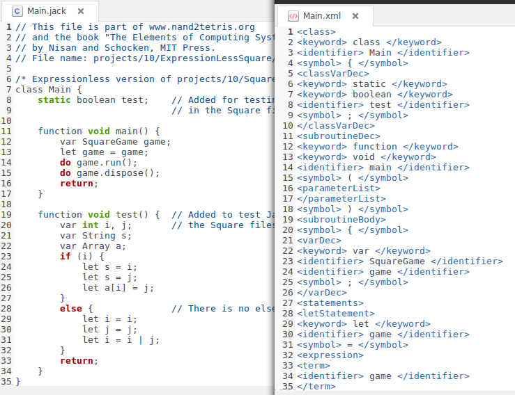

***
#### Projeto 3

Completar o projeto incluindo o gerador de código intermediário.

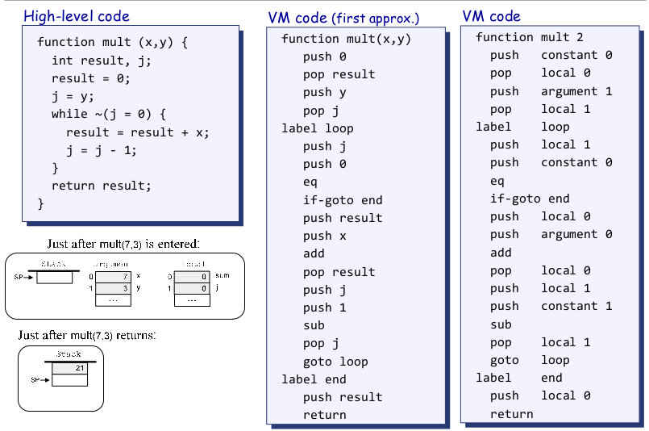

***
#### Projeto 4

Fazer um projeto separadamente, que poderá ser na mesma linguagem ou em outra, que dado um codigo na linguagem intermediária, transforme-o em código de máquina:

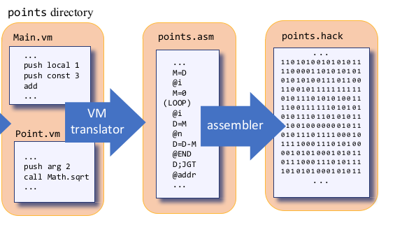


> Observação: a expectativa é chegarmos no codigo de máquina (.hack), porém no mínimo teremos que chegar até o mnemonico (.asm).
> 

### Referências

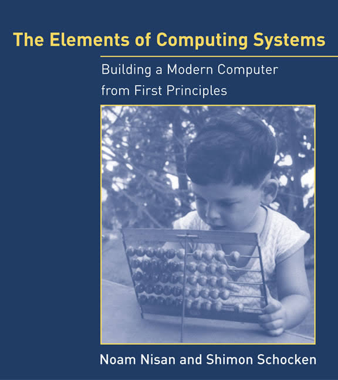

The Elements of Computing Systems: Building a Modern Computer from First Principle by Noam Nisan 	and Shimon Schocken 

Alguns capítulos estão livres no site do projeto, junto com os slides e todos os demais recursos.	

* Básicas

1. AHO, Alfred V; SETHI, RAVI; WLLMAN, JEFFREY
D. Compiladores:principios,tecnicas e ferramentas. Rio de Janeiro: Livros Tecnicos
e Cientificos, 1995. 344.
2. LOUDEN, Kenneth C. Compiladores: principios e praticas. Sao Paulo: Pioneira
Thomson Learning, 2004. 569.
3. SETZER, Valdemar W; I. MELO, INES S. HOMEM DE. A construcao de um
compilador. Rio de Janeiro: Campus, 1985. 00175.

* Complementares

1. LEWIS, Harry R. & PAPADIMITRIOU, Christos H. Elementos de Teoria da
Computação. 2.ed. Porto Alegre, Bookman,2000.
2. Price, A.M.A.; Toscani, S.S. Implementação de Linguagens de Programação –
Compiladores. Bookman, 2008.
3. [Ricarte I. Introdução à Computação. Elsevier. 2008](http://www.sciencedirect.com/science/book/9788535230673).
4. Delamaro, M.E. Como construir um Compilador – Utilizando Ferramentas Java. Novatec, 2004
5. Grune, H.D. et al. Projeto Moderno de Compiladores – implementação e
Aplicações. Elsevier, 2001.
5. Watt D.A; Brown, D. F. Programming Language Processors in Java – Compilers
and Interpreters. Pearson Education, 2000

***

