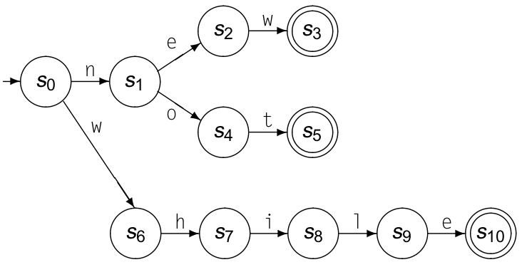
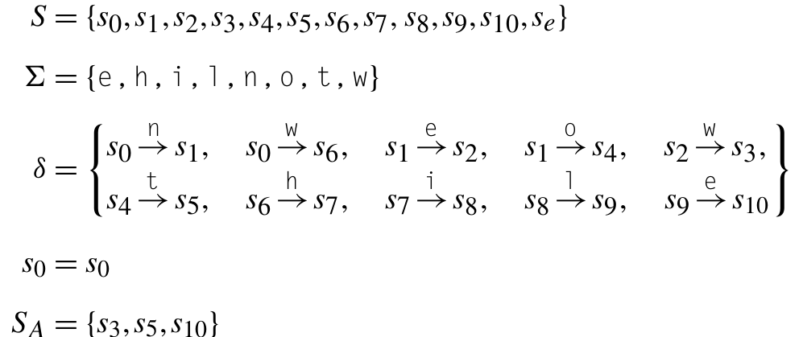
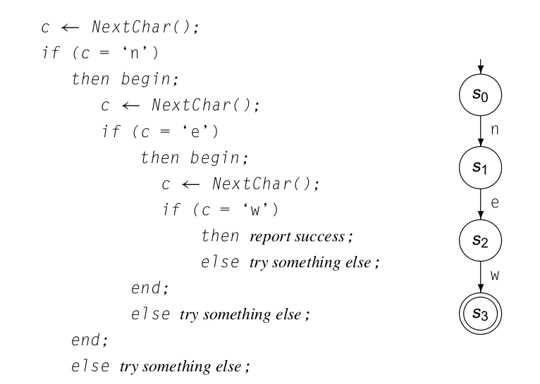
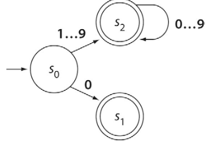

## Análise léxica: fundamentação

### Roteiro

1. Introdução
2. Autômato finito
3. Autômato finito: exemplo 
4. Autômato finito: implementação
5. Expressões regulares
6. Expressões regulares: formalização
7. Expressões regulares: exemplos
8. Expressões regulares: Experimentando
9. Expressões regulares: Java
10. Expressões regulares: Python
11. Geradores automáticos
12. Ver mais


### Introdução

* A tarefa do analisador léxico (scanner*) é:
  *  transformar um fluxo de caracteres em um fluxo de palavras na
linguagem de entrada. 
  * classificar cada palavra em uma categoria sintática, ou “classe gramatical”.  
* O scanner é o único passo do compilador a ter contato com
cada caractere do programa de entrada.
* Para conseguir esta agregação e classificação, o scanner aplica um conjunto de regras que descrevem a estrutura léxica da linguagem de programação de entrada, às vezes chamada de sua **microssintaxe**, que, em uma linguagem de programação, especifica como agrupar caracteres em palavras e, reciprocamente, como separar palavras que
estejam juntas. 
* Uma palavra consiste em um lexema e sua categoria sintática. As palavras são representadas em uma gramática por sua categoria sintática.
  * Exemplo: o lexema "contador" é associado a categoria `identificador`.

>No contexto da análise léxica, consideramos os sinais de pontuação e
outros símbolos também como palavras.


***

### Introdução

* O construtor de compilador começa a partir de uma especificação da microssintaxe da linguagem.
* codificando-a em uma notação aceita por um gerador de scanners, que então constrói um scanner executável, 
* ou então usa esta especificação para montar um scanner codificado à mão.
* A especificação da microsintaxe pode ser realizada por diagramas de transição servem como abstrações do código que seria exigido para implementá-los. Também podem ser vistos como objetos matemáticos formais, chamados autômatos finitos, que especificam os reconhecedores.


***

### Autômato finito

Formalmente, um autômato finito é descrito por cinco características, sendo portanto representável por uma quíntupla M = (S, Σ, δ, s<sub>0</sub>, S<sub>A</sub> ) (Ivan Ricarte):
1. o conjunto finito de estados, S;
2. o alfabeto de entrada finito, Σ;
3. o conjunto de transições, δ, sendo que cada transição é representada por uma tripla (s<sub>i</sub> , Σ<sub>T</sub> , s<sub>f</sub> ), em que s<sub>i</sub> ∈ S é o estado de origem da transição, Σ<sub>T</sub> ⊆ Σ é o conjunto de símbolos do alfabeto (caracteres) que disparam essa transição quando o estado corrente é s<sub>i</sub> e s<sub>f</sub> ∈ K será o novo estado corrente do autômato após a transição;
4. o estado inicial, s<sub>0</sub>, sendo que s<sub>0</sub> ∈ K;
5. o conjunto de estados finais ou de aceitação, S<sub>A</sub> , com s<sub>0</sub> ⊆ S.


***

### Autômato finito: exemplo 

O automato finito pode ser visualizado como um diagrama de transição:



Ou a partir da seguinte quíntupla:



***


### Autômato finito: implementação

Um automato finito básico, poderia ser implementado através de uma estrutura simples de `if` e `else`:



***

### Autômato finito: implementação


O exemplo a seguir é um trecho de código para ignorar comentários de bloco:

```C
look = nextChar();
if (look == '*')
{
   while (look == '*')
		look = nextChar();
    if (look == '/')
    {
		    endComment=1;
		    look = nextChar();
	  }		
}
```

***

### Expressões regulares

* Para qualquer FA, também podemos descrever sua linguagem usando uma notação chamada expressão regular (RE — Regular Expression). A linguagem descrita por uma RE é chamada linguagem regular.
* A linguagem consistindo de uma única palavra new pode ser descrita por uma RE escrita como new. Escrever dois caracteres um ao lado do outro implica que deverão aparecer nessa ordem.
* A linguagem consistindo de duas palavras new ou while pode ser escrita
como new ou while. Para evitar possíveis erros de interpretação, escrevemos isto usando o símbolo | para indicar ou. Assim, escrevemos a RE como new | while.
* A linguagem consistindo de new ou not pode ser escrita como new | not. Outras REs são possíveis, como n(ew | ot). Ambas as REs especificam o mesmo par de palavras. A RE n(ew | ot) sugere a estrutura do FA que desenhamos anteriormente para essas duas palavras.

### Expressões regulares: formalização

Podemos definir o conjunto de REs sobre um alfabeto O da seguinte maneira:

1. Se a ∈ O, então a também é uma RE indicando o conjunto contendo apenas a.
2. Se r e s são REs, indicando conjuntos L(r) e L(s), respectivamente, então r | s é uma RE indicando a união, ou alternação, de L(r) e L(s); rs é uma RE indicando a concatenação de L(r) e L(s), respectivamente; e r* é uma RE indicando o fechamento de Kleene de L(r).
3. ε é uma RE indicando o conjunto contendo apenas a string vazia.


>Para eliminar qualquer ambiguidade, parênteses possuem a precedência mais alta, seguidos pelo fechamento, concatenação e alternação, nesta ordem.

>Como uma abreviação conveniente, especificaremos intervalos de caracteres com o primeiro e o último elementos conectados por reticências, “...”. Para que esta abreviação se destaque, vamos cercá-la com um par de colchetes. Assim, [0...9] representa o conjunto de dígitos decimais, que sempre poderá ser reescrito como (0 | 1 | 2 | 3 | 4| 5 | 6 | 7 | 8 | 9).

### Expressões regulares: exemplos


* identificadores em linguagens tipo Algol, um caractere alfabético seguido por zero ou mais caracteres alfanuméricos, é simplesmente:
  
  ```
  ([A...Z] | [a...z]) ([A...Z] | [a...z] | [0...9])*.
  ```

>Se a linguagem limitar o tamanho máximo de um identificador, podemos usar o fechamento finito apropriado. Assim, identificadores limitados a seis caracteres poderiam ser especificados como:
>
> ([A...Z] | [a...z]) ([A...Z] | [a...z] | [0...9])<sup>5</sup>

* Um inteiro sem sinal pode ser descrito como zero ou um dígito diferente de zero seguido por zero ou mais dígitos

``` 
0 | [1...9] [0...9]* 
```
Esse mesma expressão é equivalente ao seguinte automâto finito:



***

### Expressões regulares: experimentando ...

Um bom local para experimentar expressões regulare é em (https://regexr.com/)

***

### Expressões regulares: Java

Em Java:

```java
import java.util.regex.Matcher;
import java.util.regex.Pattern;

class Main {
  public static void main(String[] args) {
    String s = "ola mundo, 123, fui ...";
    Pattern pattern = Pattern.compile("[a-z]+|[0-9]+");
    Matcher matcher = pattern.matcher(s);
    while (matcher.find()){ 
      System.out.println (matcher.group());
    }

  }
}
```
A execução deste código iŕa gerar a seguinte saída:

```
ola
mundo
123
fui
```
***

### Expressões regulares: Python

Em Python:

```Python
import re
reg = re.compile ("[a-z]+|[0-9]+")
s = "ola mundo, 123, fui ..."
print(reg.findall (s))
```
A execução deste código iŕa gerar a seguinte saída:

```
['ola', 'mundo', '123', 'fui']
```
***
### Geradores automáticos


* O Flex serve para gerar automaticamente programas (em C) fazendo a leitura de uma entrada, de modo a varrer um texto e/ou programa a fim de obter uma sequência de unidades léxicas (tokens).

* Os tokens gerados pelos programas criados pelo Flex serão usualmente processadas posteriormente por um programa que realizará a analise sintática.
  * Entrada: Arquivo de descrição do analisador léxico.
  * Saída: Programa na linguagem “C” que realiza a análise léxica (default: lex.yy.c)

* Outros geradores de analisadores léxicos:
  * TPly – TP Lex / Yacc => Gera um programa em PASCAL (scanner em Pascal)
  * JavaCC => Para linguagem Java
  * Flex++ ou Flexx => Para linguagem C+(orientado a objetos)

***
### Ver mais

* [EXPRESSÕES REGULARES - Livro Online, por Aurelio Jargas](https://aurelio.net/regex/guia/)
* [Expressões Regulares em Python](https://moodle-arquivo.ciencias.ulisboa.pt/1516/pluginfile.php/124902/course/section/40889/expressoes-regulares.pdf)
* [Manual Simples Expressões Regulares Python](https://pt.slideshare.net/bismarckjunior/manual-simples-expressoes-regulares-python)
* [Expressões regulares em Java](https://www.oreilly.com/library/view/java-cookbook-3rd/9781449338794/ch04.html)


