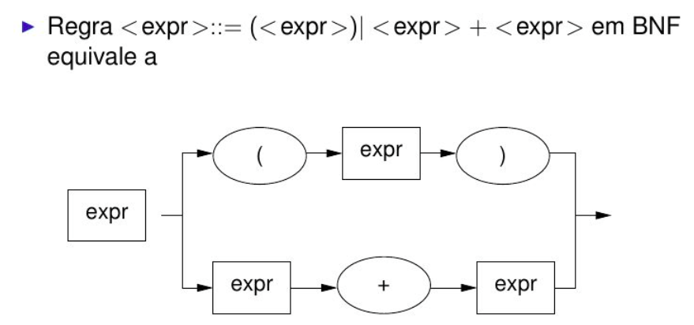
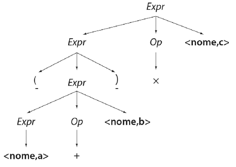
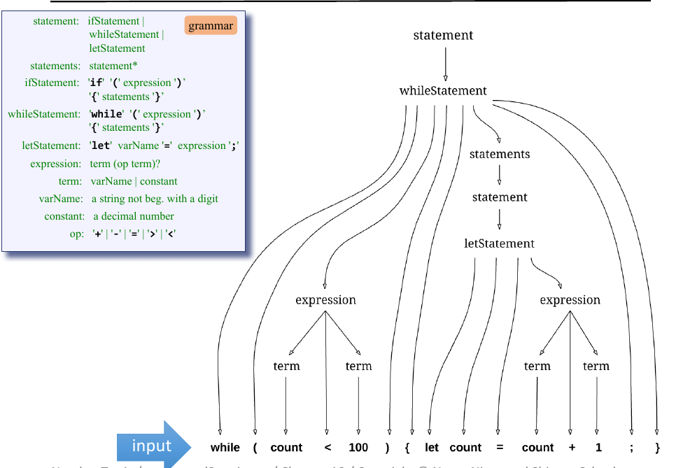
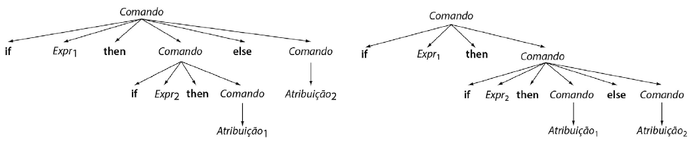

## Análise Sintática - Fundamentação

### Introdução 
Slides adaptados da excelente e suscinta aula de Ewerton Salvador: https://www.youtube.com/watch?v=KVoaWNbqeUw

e baseado no excelente livro Cooper Keith - Construção de Compiladores. 

* Cada linguagem possui regras que descrevem a estrutura sintática dos programas bem-formados

> Por exemplo, a Linguagem Jack usada neste curso é composta por classes, onde cada classe possui declarações de variáveis e métodos. Cada método possui suas variáveis locais e comandos. Comandos podem ser atribuições, comando de seleção, iteração ...

* A sintaxe de uma linguagem é usualmente especificada por uma **gramática livre de contexto**

  * Uma gramática livre de contexto, G, é um conjunto de regras que descrevem como s formar sentenças. A coleção de sentenças que podem ser derivadas de G é chamada linguagem definida por G, indicada como L(G).
  
### Análise sintática ou parser

* O segundo passo no processo de compilação é a analise sintática (também conhecido como Parser).

* Os analisadores sintáticos são baseados na gramática livre de contexto. Dado que as linguagens regulares não são capazes de identificar balanceamento de parênteses, chaves, colchetes ou outros elementos equivalentes como “begin” e “end”. Engineering a Compiler – Keith D. Cooper.

> _“To describe programming language syntax, we need a more powerful notation than regular expressions that still leads to efficient recognizers. The traditional solution is to use a context-free grammar ( cfg )” Engineering a Compiler – Keith D. Cooper._

***
### Integração com as outras etapas

Analisador sintático constrói uma arvores de derivação a partir dos tokens( símbolos terminais) recebidos do analisador léxico:
* Na prática a árvore não precisa ser construída explicitamente. Ou seja, ela pode estar implicitamente no processo de recursão que veremos mais a frente. Neste curso, numa primeira etapa iremos constuir uma árvore em XML.


***

### Tratamentos de erros sintaxes

* Enquanto os erros léxicos estão associados em geral a erros de digitação, os erros sintáticos são relacionados a estrutura de um programa.

  * Por exemplo, a linguagem Jack requer o `;` no final dos comandos. O esquecimento deste símbolo leva a um erro sintático. As atribuições inicial com a palavra reservada let, a sua ausência seria outro exemplo de erro:
  
```Java
let x = 10;
```
> Neste curso, iremos fazer um tratamento de erros simples. No primeiro erro encontrado, o analisador deve parar e emitr uma mensagem similar a:

```
Esperado ')' encontrado ';'
```

  >Importante: nesse curso não iremos implementar um analisador semântico, neste sentido não será detectados erros de tipos.

***

### Gramáticas livres de contexto

* As construções das linguagens de programação são inerentemente recursivas.
  * Por exemplo, os comandos condicionais e de iteração:
```
cmd -> if exp then cmd else cmd
```

* Gramática livre de contexto é formada por símbolos terminais, não-terminais e produções.
  * Aqui, token é sinônimo de símbolo terminal.

* Uma outra definição em inglês:
  
    _“A context-free grammar is a set of rules specifying how syntactic elements in some language can be formed from simpler ones”_
    − Simpler ones → símbolos terminais

***

### Gramática livre de contexto - Definição formal

Segundo Cooper Keith:

* Formalmente, gramática livre de contexto G é uma quádrupla (T, NT, S, P), onde: 
  - **T** é o conjunto de símbolos terminais, ou palavras, na linguagem L(G). Símbolos terminais correspondem às categorias sintáticas retornadas pelo scanner. 
  - **NT** é o conjunto de símbolos não terminais que aparecem nas produções de G. Não terminais são variáveis sintáticas introduzidas para fornecer abstração e estrutura nas produções. S é um não terminal designado como símbolo-alvo, ou símbolo inicial da gramática. 
  - **S** representa o conjunto de sentenças em L(G). O símbolo inicial da linguagem Jack sera `Class`.
  - **P** é o conjunto de produções ou regras de reescrita em G. Cada regra em P tem a forma NT → (T ∪ NT)<sup>+</sup>; ou seja, ela substitui um não terminal por uma string de um ou mais símbolos da gramática.


***

### Gramática livre de contexto - representação

As linguagens livres de contexto podem ser descritas tambem por: 
* Backus-Naur Form, 
* Diagramas sintáticos 

####  Backus-Naur Form

Define uma notação textual compacta para as produções de uma gramática livre de contexto.
* Notação mais básica:
  ```
  :=        produção
  <...>     símbolo não terminal
  |         alternativa
  ```
  
#### Diagramas sintáticos.

Notação gráfica para gramáticas livres de contexto, com um diagrama para cada símbolo não-terminal
* Símbolos não-terminais: retângulos
* Símbolos terminais: círculos ou elipses



### Derivações

* Produções são tratadas como regras de reescrita.
* Cada passo substitui um não-terminal pelo corpo de uma das produções.
   * Construção top-down (de cima pra baixo)
 * O símbolo `=>` significa "deriva em um passo".

***

### Derivações "mais a direita" ou "mais a esquerda"

* Derivação mais à direita:
    * Derivação que reescreve, a cada etapa, o não terminal mais à direita. 
* Derivação mais à esquerda:
  *  Derivação que reescreve, a cada etapa, o não terminal mais à esquerda.

***
### Derivações "mais a direita" ou "mais a esquerda" - Exemplo

(CHECAR ESSES EXEMPLOS)

* Considere a seguinte gramática de uma simples expressão apresentada no livro de Keith Cooper:

```
1) Expr =>  ( Expr ) 
2)          | Expr Op nome 
3)          | nome 
4)  Op =>   + 
5)          | - 
6)          | * 
7)          | ÷
```
* Começando com o símbolo inicial, Expr, podemos gerar dois tipos de subtermos entre parênteses, com a regra 1, ou subtermos simples, com a regra 2. 

Considere a expressão:

```
(a + b ) * c
```
***

### Derivação "mais a direita"

* Se usarmos uma derivação mais a direita obteremos a seguinte sequência de reescrita (2,6,1,2,4,3) Lembre-se de que a gramática lida com categorias sintáticas, como `nome`, em vez de lexemas, como _a_, _b_ ou _c_. Essa é uma derivação mais a direita, pois escolhe o símbolo mais a direita para a substituição:

```
            Expr 
 2          Expr Op nome 
 6          Expr × nome 
 1          ( Expr ) × nome 
 2          ( Expr Op nome ) × nome 
 4          ( Expr + nome ) × nome 
 3          ( nome + nome ) × nome
```
*** 

### Derivação "mais a esquerda"

* Se usarmos uma derivação mais a esquerda obteremos a seguinte sequência de produções:

```
        Expr 
2       Expr Op nome 
1       ( Expr ) Op nome 
2       ( Expr Op nome ) Op nome 
3       ( nome Op nome ) Op nome 
4       ( nome + nome ) Op nome 
6       ( nome + nome ) × nome
```

***

### Árvores sintáticas e ambiguidades

* Se construirmos as árvores sintáticas de ambas produções, elas serão idênticas:



No caso da linguagem Jack, podemos exemplificar com a seguinte arvore:




***

### Ambiguidades


* Keith Cooper destaca que é importante que cada sentença na linguagem definida pela gramática tenha uma única derivação mais à direita (ou mais à esquerda). 
* Se existirem várias derivações mais à direita (ou mais à esquerda) para alguma sentença, então, em algum ponto na derivação várias reescritas distintas do não terminal mais à direita (ou mais à esquerda) levam à mesma sentença. 

* **Ambiguidade**
  * Uma gramática G é ambígua se alguma sentença em L(G) tiver mais de uma derivação mais à direita (ou mais à esquerda).

***

### Ambiguidade: Exemplos

O exemplo clássico de uma construção ambígua na gramática para uma linguagem de programação é a construção if-then-else de muitas linguagens tipo Algol. A gramática simples para if-then-else poderia ser:

```
1 Comando       if Expr then Comando else Comando 
2               | if Expr then Comando 
3               | Atribuição 
4               | ...outros comandos. . . 
```

Este fragmento mostra que else é opcional. Infelizmente, o seguinte fragmento de código tem duas derivações mais a direita, gerando diferentes árvores sintáticas:

_if Exp<sub>1</sub> then if Exp<sub>1</sub> then Atribuição<sub>1</sub> else Atribuição<sub>2</sub>_




Para remover essa ambiguidade, a gramática deve ser modificada para incluir uma regra que determina qual if controla um else. 


*** 
### Técnicas de análise sintática

Análise gramatical é o processo de se determinar se uma cadeia de tokens pode ser gerado por uma gramática, ou seja, gerar uma árvore sintática dado uma coleção de tokens. Segundo Keith Cooper existem duas metodologias distintas e opostas para construir a árvore são sugeridas:

1. Parsers **top-down** começam com a raiz e fazem a árvore crescer em direção às folhas. A cada etapa, ele seleciona um nó para algum não terminal na borda inferior da árvore e o estende como uma subárvore que representa o lado direito de uma produção que reescreve o não terminal. 
2. Parsers **bottom-up** começam com as folhas e fazem a árvore crescer em direção à raiz. Em cada etapa, ele identifica uma substring contígua da borda superior da árvore, que corresponde ao lado direito de alguma produção; depois, constrói um nó para o lado esquerdo da regra e o conecta à árvore.

***
### Top-down vs bottom-up

* O método top-down é preferido quando os o analisadores são construidos “manualmente”, ou seja, sem um software gerador. São mais fáceis de serem desenvolvidos. 
* De acordo com Aho (1986) o método bottom-up é mais dificil de ser implementado manualmente, porém pode manipular uma classe mais ampla de gramáticas (LR). Sendo preferidos pelas ferramentas que geram analisadores sintáticos.

>Nesse curso iremos usar a metodologia top-down para desenvolver um parser manualmente, como veremos mais a frente.

### Parsers **top-down**


* A construção top-down de uma arvore gramátical é feita iniciando-se pela raiz, rotulada pelo não-terminal de partida e realizando recursivamenteo os dois seguintes passos:
  * Ao nó n, rotulado por um não terminal A, selecione uma das produções para A e construa os filhos de n com os símbolos no lado direito da produção.
  * Encontre o próximo nó qual uma subárvore deva ser construída da cadeia de entrada.


***

### Parsers **top-down** e retrocesso

* Uma produção para um não terminal pode envolver tentativa e erro; ou seja; podemos ter que tentar uma produção, retroceder e tentar outra produção. 
* Existe um caso especial, chamado de análise gramatical preditiva, no qual o retrocesso não ocorre. 
* Análise gramatical descendente recursiva é um método top-down de análise sintática no qual executamos um conjunto de procedimentos recursivos para processar a entrada.

### A eficiência nos parsers **top-down** 

* A eficiência de um parser top-down depende criticamente da sua capacidade de escolher a produção correta toda vez que expandir um não terminal. 
* Se o parser sempre fizer a escolha certa, a análise sintática top-down é eficiente. Se restar escolhas ruins, o custo da análise aumenta. Ele ter que fazer retrocessos (backtracking)
* Para algumas gramáticas, o comportamento de pior caso é que o parser não termina. 


***

### Análise sintática livre de retrocesso

A principal fonte de ineficiência no parser top-down mais à esquerda surge da sua necessidade de retroceder. 
 * Quando ele descobre a divergência, precisa desfazer as ações que resultaram na borda errada e tentar outras produções. 
 * O ato de expandir, retrair e reexpandir a borda desperdiça tempo e esforço.

o parser pode evitar o retrocesso com uma modificação simples. 
* Quando ele for selecionar a próxima produção, pode considerar tanto o símbolo em foco quanto o próximo símbolo de entrada, chamado **símbolo de antecipação**. 
* Usando este único símbolo de antecipação, o parser pode distinguir todas as escolhas que surgem na análise sintática. Assim, dizemos que a gramática é livre de retrocesso com antecipação de um símbolo (LL(1)). 
* Uma gramática livre de retrocesso também é chamada gramática preditiva.

> **Gramática LL(1)**
> 
>A classe mais simples e restrita de gramáticas é conhecida como LL(1), indicando que
> - a cadeia de entrada é examinada da esquerda para a direita (L=left-to-right); 
> - o analisador procura construir uma derivação esquerda (L=leftmost); 
> - exatamente 1 símbolo do resto da entrada é examinado.

### Analisador sintático preditivo

O analisador sintático preditivo é baseado na técnica de construção descendente. 
* Assim, no processo de reconhecimento de uma sentença, ele inicia com o símbolo sentencial e, pela análise dos próximos símbolos da sentença, decide qual produção deve ser aplicada para expandir o símbolo não-terminal corrente. 
* Se a cada aplicação de uma expansão a informação é atualizada na estrutura da árvore sintática, ao final do processo de reconhecimento de uma sentença válida o resultado será a árvore sintática completa para a sentença.

> Neste curso iremos implementar um analisados sintático preditivo.

### Especificação

Antes de entrarmos em mais detalhes sobre a implementação do parser, vamos visualizar um subset da gramática. Para descrever a gramática, não foi usada a BNF original, e sim as seguintec conveções:

* ‘**xxx**’ : os simbolos terminais são apresentado em negrito e entre aspas simples.
* xxx: os simbolos não terminais usa fontes regulares.
* (): parenteses são usados para agrupar alguns construtores, usualmente dentro de um grupo de opções.
* x|y: alternativas, indica que pode ser usado `x` ou `y`
indicates that either x or y can appear;
* x?: opcional até 1, indica que pode aparecer 0 ou 1 vez.
* x*: opcional vários, indica que pode aparecer 0 ou mais vezes.

### Especificação: exemplo de subset


Veja os slides 18 a 28 em [Nand2Tetris](https://drive.google.com/file/d/1ujgcS7GoI-zu56FxhfkTAvEgZ6JT7Dxl/view?usp=sharing)

```
statement:    ifStatement 
              | whileStatement 
              | letStatement
 statements: statement*
ifStatement: 'if' '(' expression ')’
'{' statements '}’
whileStatement: 'while' '(' expression ')’
'{' statements '}’
letStatement: 'let' varName '=' expression ';'
expression: term (op term)?
term: varName | constant
varName: a string not beginning with a digit
constant: a decimal number
```